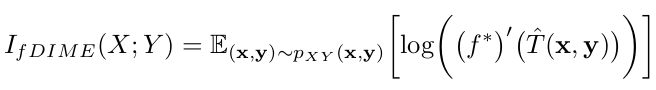
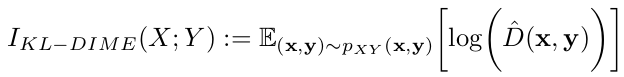
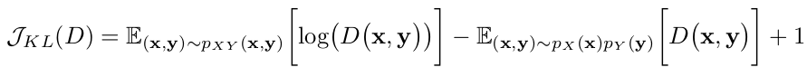
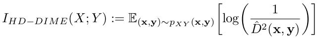
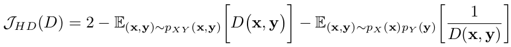
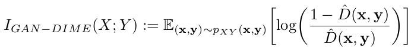
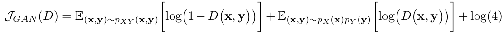

# Discriminative Mutual Information Estimators based on the variational representation of the $f$-divergence

PyTorch implementation for the paper "Variational $f$-Divergence and Derangements for Discriminative Mutual Information Estimation".

---

## General description

The code comprises the implementation of various existing mutual information (MI) estimators (e.g. MINE, NWJ, InfoNCE, SMILE, NJEE) that are compared with our proposed new class of MI estimators: $f$-DIME:



In particular, we developed three different estimators, based on three different $f$-divergences:

- **KL-DIME** (based on the Kullback-Leibler divergence) 


   where $\hat{D}$ is obtained by maximizing  


- **HD-DIME** (based on the squared Hellinger distance)


   where $\hat{D}$ is obtained by maximizing  



- **GAN-DIME** (based on the GAN/Jansen-Shannon divergence)


   where $\hat{D}$ is obtained by maximizing  


---

## How to run the code

All the MI estimators are implemented in `utils.py`.

The neural networks, the class handling training/test of the estimators, and the main functions needed to run the code are implemented in `classes.py`.

The file `main.py` runs all the experiments. 
There are two running modalities that are accepted by the argument parser:
- "staircase": runs the training where the target mutual information has a staircase shape;
- "consistency_test": runs the self-consistency tests over the MNIST dataset.

Thus, you can run `main.py` by setting the argument "mode":
> python main.py --mode staircase

or by fixing the default mode of the parser to the desired one:
```default='consistency_test'```

---

## Citation

If you use your code for your research, please cite our paper:


---

## Contact

[nicola.novello@aau.at](nicola.novello@aau.at)
