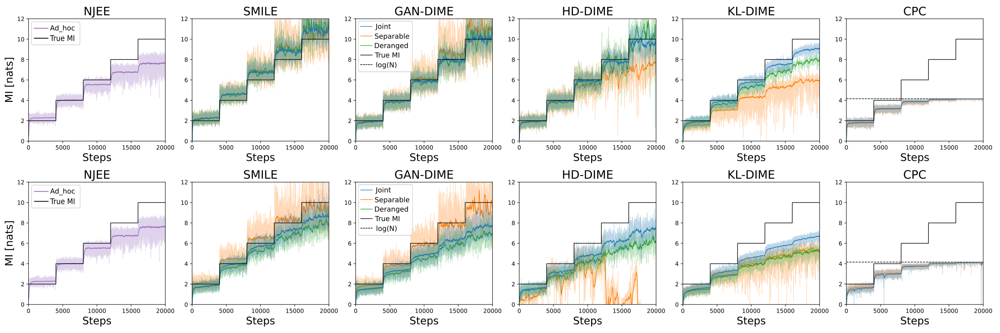
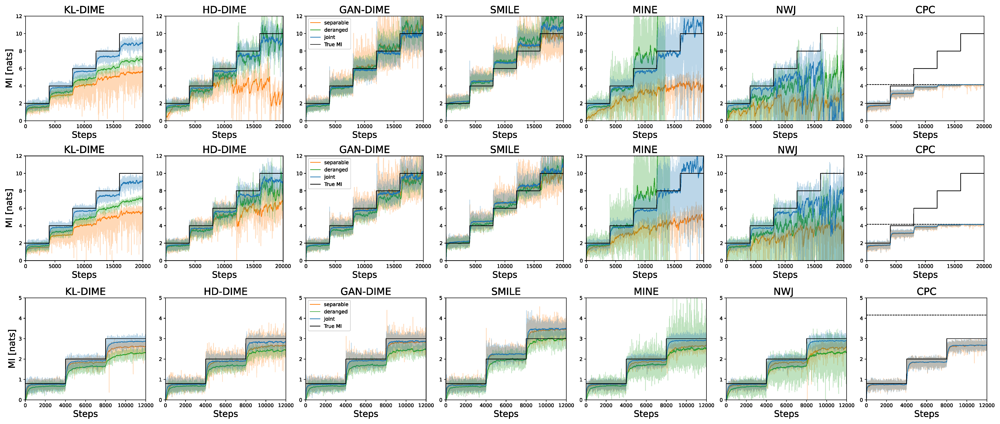
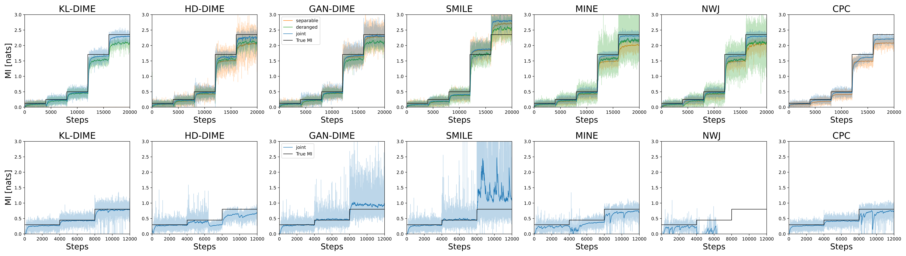

<div align="center">
   
# Mutual Information Estimation via $f$-Divergence and Data Derangements

[Nunzio A. Letizia](https://scholar.google.com/citations?user=v50jRAIAAAAJ&hl=en), [Nicola Novello](https://scholar.google.com/citations?user=4PPM0GkAAAAJ&hl=en), [Andrea M. Tonello](https://scholar.google.com/citations?user=qBiseEsAAAAJ&hl=en)<br />

</div>

Official repository of the paper "Mutual Information Estimation via $f$-Divergence and Data Derangements" published at NeurIPS 2024.

> $f$-DIME is a novel mutual information estimator based on the $f$-divergence and characterized by low variance. In the paper, we study the importance of using a data derangement method w.r.t. a standard random permutation.

<div align="center">

[](https://github.com/nicolaNovello/fDIME/blob/main/LICENSE)
[](https://hits.sh/github.com/nicolaNovello/fDIME/)

</div>

---

# 📈 Important results from our paper

## Derangement vs permutation

To train neural mutual information estimators, it is crucial to obtain a batch of samples of $p_X(\mathbf{x})p_Y(\mathbf{y})$ from the batch drawn from $p_{XY}(\mathbf{x}, \mathbf{y})$. The figure shows that using a random permutation mechanism leads to an upper bound. The same bound is not present when using a derangement mechanism.
    Permutation         |   Derangement
:-------------------------:|:-------------------------:
 | 

## Low variance and low bias MI estimate

The figures below show the comparison between the performance of well-known MI estimators and $f$-DIME. All the scenarios are described in the [paper](https://proceedings.neurips.cc/paper_files/paper/2024/hash/bdcfa850adac4a1088153881282ca972-Abstract-Conference.html), where additional results are also shown.
### Gaussian and Cubic


### Half-cube, Asinh, Swiss roll


### Uniform and Student


---

# 💻 How to run the code

The file `main.py` runs all the experiments. 
There are four running modalities that are accepted by the argument parser:
- "staircase": target MI has a staircase shape and the scenario is Gaussian, Cubic, Asinh, and Half-cube;
- "uniform": MI of uniform random variables;
- "swiss": MI of the swiss-roll scenario;
- "student": MI of the multivariate student distribution scenario.

The code is set up to run using multiprocessing, using one process for each possible architecture type. The types of architectures implemented are: "joint", "deranged", and "separable", which can be set modifying the variable `architectures_list`.

To test various MI estimators, the field 'divergences' in the dictionary `proc_params` can be set to "MINE", "NWJ", "SMILE", "CPC" for the related works, and "KL", "HD", "GAN", and "SL" for fDIME. "SL" is the shifted-log divergence proposed in [1], which achieves great performance but is not included in the experiments of the paper.

You can run `main.py` by setting the argument "mode":
> python main.py --mode staircase

or by fixing the default mode of the parser to the desired one:
```default='staircase'```

[1] Novello, N. and Tonello, A. M. f -divergence based classification: Beyond the use of cross-entropy. In International Conference on Machine Learning, pp. 38448–38473. PMLR, 2024.


---

## 🤓 General description

The code comprises the implementation of various existing mutual information (MI) estimators (e.g. MINE, NWJ, InfoNCE, SMILE, NJEE) that are compared with our proposed new class of MI estimators: $f$-DIME:

$I_{fDIME}(X;Y) = \mathbb{E}_ {p_{XY}(\mathbf{x},\mathbf{y})} \biggl[ \log \biggl( \bigl( f^* \bigr)^ {'} \bigl(\hat{T}(\mathbf{x},\mathbf{y})\bigr) \biggr) \biggr],$ 

where $\hat{T}$ is obtained by maximizing

$\mathcal{J}_ {f}(T) =  \mathbb{E}_ {(\mathbf{x},\mathbf{y}) \sim p_ {XY}(\mathbf{x},\mathbf{y})}\biggl[T\bigl(\mathbf{x},\mathbf{y}\bigr)-f^*\biggl(T\bigl(\mathbf{x},\sigma(\mathbf{y})\bigr)\biggr)\biggr].$

In particular, we developed three different estimators, based on three different $f$-divergences:

- **KL-DIME** (based on the Kullback-Leibler divergence)

   $I_ {KL-DIME}(X;Y) :=  \mathbb{E}_ {(\mathbf{x},\mathbf{y}) \sim p_ {XY}(\mathbf{x},\mathbf{y})}\biggl[ \log \biggl(\hat{D}(\mathbf{x},\mathbf{y})\biggr) \biggr],$

   where $\hat{D}$ is obtained by maximizing  
   $\mathcal{J}_ {KL}(D) = \mathbb{E}_ {(\mathbf{x},\mathbf{y}) \sim p_ {XY}(\mathbf{x},\mathbf{y})}\biggl[\log\bigl(D\bigl(\mathbf{x},\mathbf{y}\bigr)\bigr)\biggr] -\mathbb{E}_ {(\mathbf{x},\mathbf{y}) \sim p_ {X}(\mathbf{x})p_ {Y}(\mathbf{y})}\biggl[D\bigl(\mathbf{x},\mathbf{y}\bigr)\biggr]+1.$

- **HD-DIME** (based on the squared Hellinger distance)

   $I_ {HD-DIME}(X;Y) :=  \mathbb{E}_ {(\mathbf{x},\mathbf{y}) \sim p_ {XY}(\mathbf{x},\mathbf{y})}\biggl[ \log \biggl(\frac{1}{\hat{D}^2(\mathbf{x},\mathbf{y})}\biggr) \biggr],$

   where $\hat{D}$ is obtained by maximizing  
$\mathcal{J}_ {HD}(D) = 2-\mathbb{E}_ {(\mathbf{x},\mathbf{y}) \sim p_ {XY}(\mathbf{x},\mathbf{y})}\biggl[D\bigl(\mathbf{x},\mathbf{y}\bigr)\biggr] -\mathbb{E}_ {(\mathbf{x},\mathbf{y}) \sim p_{X}(\mathbf{x})p_ {Y}(\mathbf{y})}\biggl[\frac{1}{D(\mathbf{x},\mathbf{y})}\biggr].$


- **GAN-DIME** (based on the GAN/Jensen-Shannon divergence)

   $I_ {GAN-DIME}(X;Y) :=  \mathbb{E}_ {(\mathbf{x},\mathbf{y}) \sim p_ {XY}(\mathbf{x},\mathbf{y})}\biggl[ \log \biggl(\frac{1-\hat{D}(\mathbf{x},\mathbf{y})}{\hat{D}(\mathbf{x},\mathbf{y})}\biggr) \biggr],$

   where $\hat{D}$ is obtained by maximizing  
$\mathcal{J}_ {GAN}(D) = \mathbb{E}_ {(\mathbf{x},\mathbf{y}) \sim p_ {XY}(\mathbf{x},\mathbf{y})} \biggl[ \log \bigl( 1- D \bigl( \mathbf{x}, \mathbf{y} \bigr) \bigr) \biggr] +\mathbb{E}_ {(\mathbf{x},\mathbf{y}) \sim p_{X}(\mathbf{x})p_ {Y}(\mathbf{y})}\biggl[ \log \bigl( D \bigl( \mathbf{x}, \mathbf{y} \bigr) \bigr) \biggr] + \log(4).$

---

## 📝 References 

If you use the code for your research, please cite our paper:
```
@inproceedings{NEURIPS2024_bdcfa850,
 author = {Letizia, Nunzio Alexandro and Novello, Nicola and Tonello, Andrea M},
 booktitle = {Advances in Neural Information Processing Systems},
 pages = {105114--105150},
 title = {Mutual Information Estimation via f-Divergence and Data Derangements},
 volume = {37},
 year = {2024}
}
```
## 📋 Acknowledgments

The implementation is based on / inspired by:

- [https://github.com/ermongroup/smile-mi-estimator](https://github.com/ermongroup/smile-mi-estimator)
- [https://github.com/YuvalShalev/NJEE](https://github.com/YuvalShalev/NJEE)


---

## 📧 Contact

[nicola.novello@aau.at](nicola.novello@aau.at)
